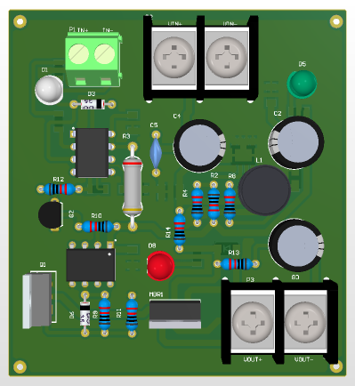

# High-Power PWM Driver 
A heavy-duty DC switching module designed for high-frequency PWM applications (DC motors, solenoids), featuring high-speed isolation and a dedicated 6A gate driver for maximum efficiency.

## Functions
*   **High-Side Switching:** Controls high-current DC loads via a low-side N-Channel MOSFET configuration.
*   **Galvanic Isolation:** Completely separates the sensitive microcontroller logic from the high-voltage power bus.
*   **High-Frequency PWM:** Capable of handling fast PWM frequencies (up to 100kHz+) suitable for precise motor speed control without heating up the driver.
*   **Self-Powered:** Generates its own 12V gate-drive voltage from the main HV bus via an onboard buck converter.

## Technical Highlights (Design Evaluation)

This is a professional-grade driver, superior to standard MOSFET modules due to three key architectural decisions:

*   **High-Speed Isolation (6N137):** Unlike the slow PC817 (kHz range) used in cheap modules, this design uses the **6N137 (10 Mbps)** optocoupler, preserving PWM signal integrity and edge sharpness at high frequencies.
*   **Dedicated Gate Driver (TC4420):** A robust **6A High-Speed MOSFET Driver** is used to charge/discharge the MOSFET gate capacitance instantly. This minimizes the "linear region" time during switching, drastically reducing heat dissipation and allowing the MOSFET to run cool under load.
*   **Robust Power Stage (IRFB4110):** Features the **IRFB4110** (100V, Low Rds-on) paired with a comprehensive snubber network (R13/C8) and a TVS Diode (**SMAJ45A**) to absorb inductive voltage spikes, protecting the silicon from flyback damage.
*   **HV Buck Converter (XL7005A):** Instead of linear regulators, a high-voltage buck converter steps down the main battery voltage (up to 80V input capability) to stable 12V for the gate driver, ensuring efficiency across a wide input range.

## Specifications
*   **Load Voltage:** 12V - 60V DC (Dependent on Capacitor ratings/XL7005).
*   **Switching Component:** IRFB4110 (100V N-MOSFET).
*   **Gate Drive:** TC4420 (6A Peak).
*   **Isolation:** 6N137 High-Speed Opto.
*   **Logic Input:** 3.3V / 5V Compatible.

## Pinout
| Pin | Description |
| :--- | :--- |
| **P2 (VIN+/VIN-)** | High Voltage DC Input |
| **P3 (LOAD+/LOAD-)** | Output to Motor/Load |
| **P1 (IN+/IN-)** | PWM Control Signal |
